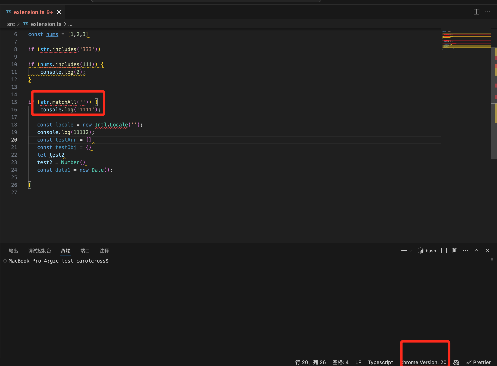
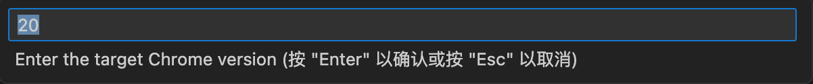
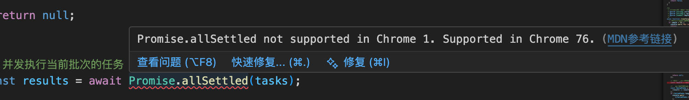
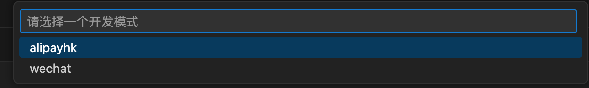
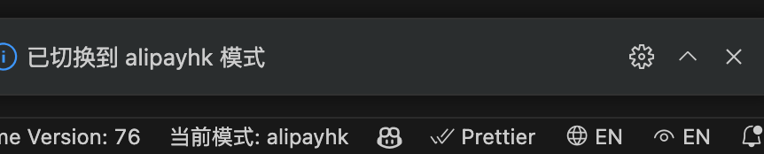

# 🚀 JS API Check for VS Code

> **智能检测 JavaScript API 浏览器兼容性，让开发更安心**

[](https://marketplace.visualstudio.com/items?itemName=cross.jsapi-check)
[](https://marketplace.visualstudio.com/items?itemName=cross.jsapi-check)
[](./LICENSE.txt)

## ✨ 主要功能

| 功能 | 描述 |
|------|------|
| 🔍 **智能检测** | 自动分析 JS/TS/Vue 代码中的浏览器兼容性问题 |
| 🌐 **多浏览器支持** | 支持 Chrome、Safari、Firefox 等主流浏览器 |
| 📱 **开发模式切换** | 支持 alipayHk、wechat 等不同开发环境 |
| 📚 **MDN 文档链接** | 一键跳转到 MDN 查看详细 API 文档 |
| ⚡ **实时检测** | 代码修改时实时显示兼容性警告 |

## 🎯 支持的文件类型

- **JavaScript**: `.js`, `.jsx`, `.mjs`, `.cjs`
- **TypeScript**: `.ts`, `.tsx`, `.TS`
- **Vue**: `.vue`, `.VUE`

## 🚀 快速开始

### 1️⃣ 安装扩展

#### 方式一：VS Code Marketplace（推荐）
1. 按 `Ctrl+Shift+X` 打开扩展面板
2. 搜索 `jsapi-check`
3. 点击安装

#### 方式二：VSIX 文件安装
1. 下载 [jsapi-check.vsix](https://marketplace.visualstudio.com/items?itemName=cross.jsapi-check)
2. VS Code 中按 `Ctrl+Shift+P`
3. 输入 `Install from VSIX`
4. 选择下载的文件

### 2️⃣ 配置浏览器版本

- **默认版本**: Chrome 72 (alipayHk 模式)
- **切换方式**: 右下角状态栏点击切换
- **支持模式**: alipayHk、wechat 等

### 3️⃣ 开始使用

打开任意 JS/TS/Vue 文件，扩展会自动检测并显示兼容性问题：

```javascript
// 示例：Chrome 72 不支持 String.matchAll
"hello world".matchAll(/hello/g); // ⚠️ 兼容性警告
```

## 📸 界面预览

### 主界面


### 兼容性检测


### 问题面板


### 开发模式切换




## ⚙️ 配置说明

### 浏览器版本设置
- **Chrome 72**: alipayHk 开发环境
- **Chrome 73+**: 支持更多现代 API
- **自定义版本**: 可手动输入任意版本号

### 检测规则
- 自动识别 ES6+ 新特性
- 检测 DOM API 兼容性
- 支持 TypeScript 类型推断

## 🔧 开发相关

### 项目结构
```
src/
├── activation/          # 扩展激活逻辑
├── core/               # 核心功能模块
│   ├── ast/           # AST 解析
│   ├── compatibility/ # 兼容性检测
│   └── diagnostic/    # 诊断信息
└── utils/             # 工具函数
```

### 版本管理
```bash
# 自动版本更新
yarn version:auto      # 智能分析提交类型
yarn publish:auto      # 自动发布

# 手动版本更新
yarn version:patch     # 补丁版本
yarn version:minor     # 次要版本
yarn version:major     # 主要版本
```

## 📚 相关链接

- **Marketplace**: [jsapi-check](https://marketplace.visualstudio.com/items?itemName=cross.jsapi-check)
- **GitHub**: [carolCross/jsapi-check](https://github.com/carolCross/jsapi-check)
- **Changelog**: [更新日志](./CHANGELOG.md)
- **License**: [MIT License](./LICENSE.txt)

## 🌟 Star History

<a href="https://star-history.com/#carolCross/jsapi-check&Date">
  <picture>
    <source media="(prefers-color-scheme: dark)" srcset="https://api.star-history.com/svg?repos=carolCross/jsapi-check&type=Date&theme=dark" />
    <source media="(prefers-color-scheme: light)" srcset="https://api.star-history.com/svg?Date" />
    
  </picture>
</a>

---

<div align="center">

**如果这个扩展对你有帮助，请给个 ⭐ Star 支持一下！**

Made with ❤️ by [carolCross](https://github.com/carolCross)

</div>
