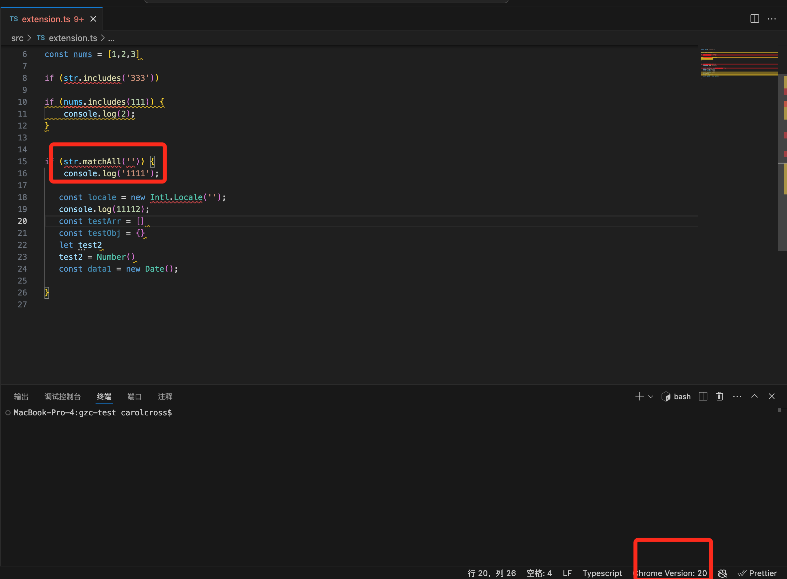
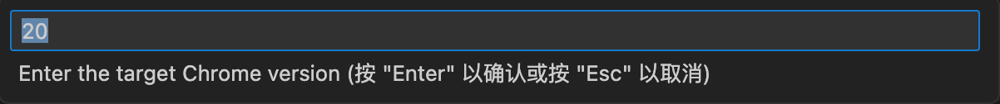
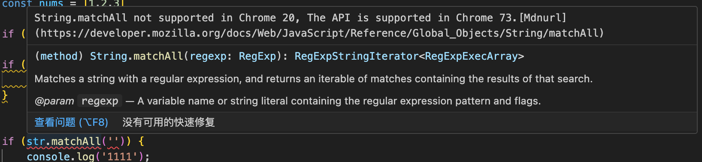

# jsapi-check for VS Code

jsapi-check 是一个为 Visual Studio Code 开发的插件，它帮助开发者识别并解决 JavaScript 代码中可能存在的浏览器兼容性问题。

## 功能

- **浏览器兼容性检查**：自动分析你的 JavaScript 代码，标识出可能不被所有目标浏览器支持的 API。
- **支持不同chrome浏览器切换**：在 VS Code 问题窗口中直接显示不兼容的 API 以及相关的 MDN 文档链接。
- **详细问题报告**：在 VS Code 问题窗口中直接显示不兼容的 API 以及相关的 MDN 文档链接。

## 支持文件格式
- **js**：支持.js、.jsx、.mjs、.cjs 文件格式检测
- **ts**：支持.ts、tsx、.TS 文件格式检测
- **vue**：支持.vue、.VUE 文件格式检测

## 界面

## 安装

你可以通过以下方式安装 jsapi-check 插件：

### 通过 Visual Studio Code Marketplace

[Marketplace——jsapi-check地址](https://marketplace.visualstudio.com/items?itemName=cross.jsapi-check)

1. 打开 VS Code。
2. 转到 Extensions 视图（视图 -> 扩展或使用 `Ctrl+Shift+X` 快捷键）。
3. 在搜索框中输入 "jsapi-check"。
4. 找到 jsapi-check 插件，点击安装。

## Changelog

[CHANGELOG](./CHANGELOG.md)

## License

[LICENSE](./LICENSE.txt)

## github
[github地址](https://github.com/carolCross/jsapi-check)